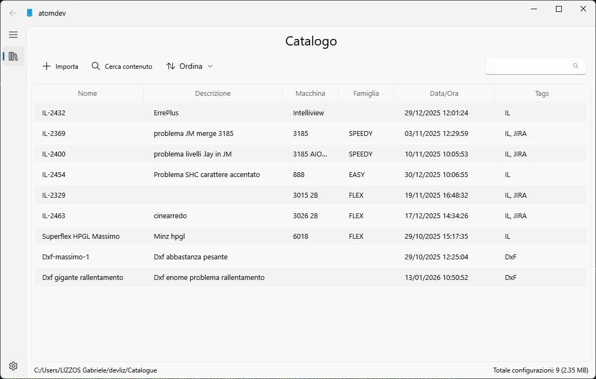
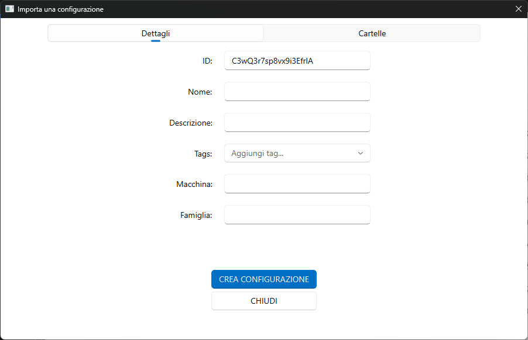
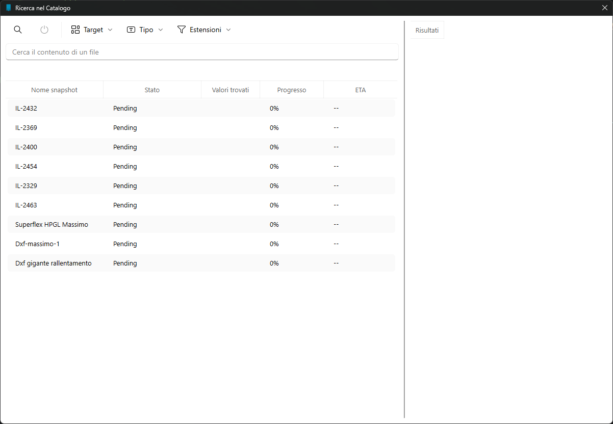

# ATOMDEV
Piccolo software per catalogare in maniera semplice e veloce le configurazioni dei software ATOM.

## Funzionamento

### STEP 1: Installazione del config
Installare localmente sul proprio pc la configurazione del programma che si vuole salvare.

Esempio: Nel caso di **InteractiveLayout** copiarsi localmente nel pc le seguenti directory:
- C:\ProgramData\ATOM\Config
- C:\ProgramData\ATOM\ConfigX

### STEP 2: Importazione della configurazione
Avviare ATOMDEV e cliccare sul pulsante "Importa". Verrà fuori la seguente schermata.

La schermata è divisa in due sezioni:
- Sezione Dettagli: Qua si specificano i dettagli della configurazione che si vuole salvare
- Sezione Cartelle: Qua si specificano le cartelle da includere nella configurazione

Cominciando dalla sezione "Dettagli", i campi da compilare sono i seguenti:
- **Nome**: Nome della configurazione
- **Descrizione**: breve descrizione della configurazione
- **Tag**: Parola chiave per facilitare la ricerca della configurazione (i tag si possono definire nelle impostazioni)
- **Macchina**: se è una configurazione di Interactive, specificare il modello della macchina
- **Famiglia**: se è una configurazione di Interactive, specificare la famiglia della macchina (SPEEDY, FLEX, EASY)

Successivamente bisogna andare nella sezione "Cartelle", che appare cosi:

Qua bisogna dire al software quali cartelle includere nella configurazione.

Ci sono due modi:
1. Cliccare sul pulsante "Aggiungi Cartella locale" e selezionare manualmente la cartella da includere
2. Selezionare una cartella "preferita", configurabile nelle impostazioni.

Le cartelle "preferite" di default sono:
- C:\ProgramData\ATOM\Config
- C:\ProgramData\ATOM\ConfigX 
- C:\isac 
- C:\plc

Arrivati a questo punto cliccando su "Crea configurazione" verrà effettuata una copia delle cartelle selezionate all'interno del software.

NOTA: Tutte le configurazioni vengono salvate nella cartella del programma che di default si trova in:

***C:\Users\<TUO UTENTE>\AtomDev\Catalogue***

Questa cartella è configurabile nelle impostazioni.

### STEP 3: Installazione della configurazione

Una volta che la configurazione è stata aggiunta nel programma, per installarla sul pc attuale basta fare **tasto DX -> Installa**.

Questo comando sovrascriverà le cartelle locali con quelle salvate nella configurazione.

## Installazione di ATOMDEV
1. Scaricare l'installer dalla pagina delle release di questa repository
2. Eseguire l'installer.

**NOTA**: Atomdev funziona solo su sistemi Windows

## Funzionalità aggiuntive

### Ricerca contenuto
Cliccando sul pulsante "Cerca Contenuto" è possibile eseguire una ricerca all'interno di tutte le configurazioni nel catalogo.

La finestra che viene fuori è questa:

È possibile cercare:
- Una parole all'interno dei file di configurazione
- il nome di un file contenuto nelle cartelle incluse nella configurazione